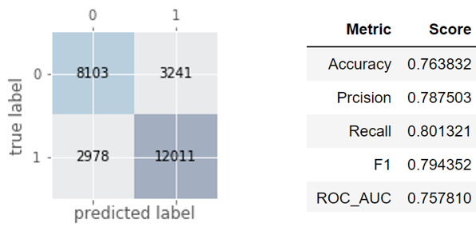
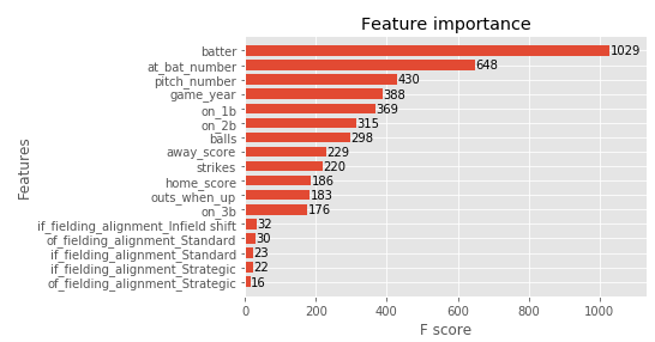

# xgboost_pitch_prediction

Using extreme gradient boosting to predict Major League Baseball pitch selection.

## Introduction

Pitch sequencing is an essential tool in today's game for top tier pitchers. Selecting which pitch type (e.g., fastball, curveball, etc.) to throw next is a complex decision for MLB pitchers. An ability to predict what type of pitch a pitcher is going to throw next gives hitters a huge advantage. A professional position player in Major League Baseball (MLB) stands a good chance of hitting any pitch they know is coming. The pursuit of the advantage foreknowledge of pitch selection was at the crux of the recent controversies surrounding the Houston Astros, particularly around their 2017 World Series win over the Los Angeles Dodgers.

Leaving the sore subject (for this Dodger fan) of the Houston Astros aside, in this notebook we are going to use machine learning techniques to learn a predictive model that will take in a pitcher's past history of pitch selections in various game states and return a prediction for which pitch the pitcher will serve up next. In this notebook we focus on building a model for future Hall of Famer Clayton Kershaw, but the techniques and strategies are general and same modeling approach will work for any pitcher.

The dataset we will base this analysis on was generated using the pybaseball package (https://github.com/jldbc/pybaseball). pybaseball pulls the data to fill a query from FanGraphs and Baseball Reference, with the original data generation being accomplished by Statcast (see https://en.wikipedia.org/wiki/Statcast).

In this baseline implementation of extreme gradient boosting (XGBoost) (see https://xgboost.readthedocs.io/en/latest/), we use the default hyperparameter values in the gradient boosting model and obtain these respectable (but not spectacular) results:

It is an item for a future notebook to look at hyperparameter tuning strategies, keeping in mind that there is an irreducibly random element in the dataset given that the selection of which pitch to throw is a decision by a human mind and so is not deterministically determined by the game state (at least not by the high-level features we have collected in this dataset, discussions of the nature of free will and determinism not withstanding). 

Extreme gradient boosting is a black box model, its complex nature making simple interpretations impossible. A quick way to begin interpreting the trained model is to look at the feature importance scores derived from the training of the decision trees in the gradient boosting process.

It makes intuitive sense that fastball pitch selection is heavily dependent on which batter is at the plate, the inning (which 'at_bat_number' correlates with), the pitch_number (Kershaw likes to start off with a fastball strike to get ahead in the count), the game year (Kershaw is throwing less fastballs recently as his velocity has decreased), etc. A deep dive on interpreting the model will be the subject of a future notebook. 

The model is non-trivially better on the training data versus the testing data. On its face, this is not unexpected, but this can also be a sign that the model is overfitting. I will definitely take a look at hyperparameter tuning to optimize the bias versus variance tradeoff in the model complexity. We will also look at simpler linear models to see if a significantly simpler model performs more optimally on this dataset. Stay tuned!